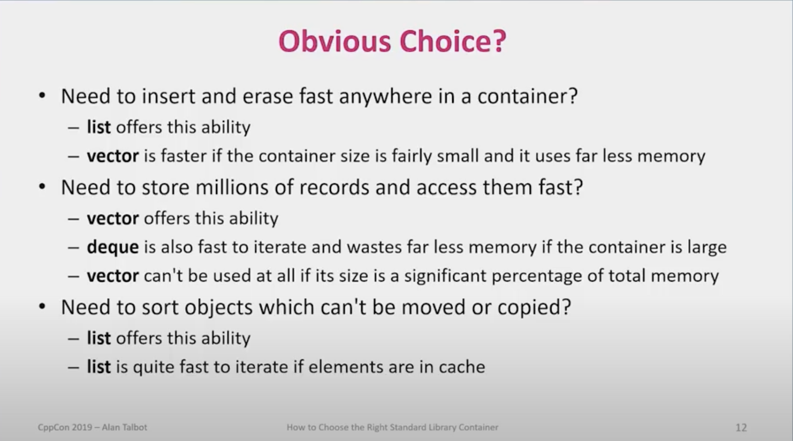

# Containers

## When do you need them?
When you are <u> processing more than one data element </u> of some kind (ideally a list of more than just a few items/records of same type T).

Then, depending on the size of your data and your different data-processing needs, you can consider using different containers in STL.

## What Different Processing Requirements?

Let's assume you have a list of N = 1000 records.
You must consider the following criterions when choosing the right container:

| Requirements                   | Details
| --------------                 | ------- |
| Fixed Size N?                  |  Does the size of list changes ?
| Creation                          |  Is the entire list created once or you insert items one-by-one?
| Insertion/Deletion           |  Will you be adding/removing items to the list?
| Order Preserving?          |  Do you care about the order of the elements?
| Sorted?                           |  Do you want to keep the data sorted?
| Duplicates?                    |  Do you allow duplicate items?
| Associative Data?          |  Do you have associative data like <key, value> pairs?


### Complexity Refresher

Different operations on containers will have different complexities dependent on the size of input N:

O(1) -  constant time, i.e. complexity does'nt depend on the size of the input N.<br>
O(N) -  Complexity grows linearly with the size N of the input.
<br>
O(logN) -  Complexity grows logarithmically to size N of the input.




| interface| std::array | std::vector | std::list | std::deque |
| ---------| --------- | ----------- | ----------- | ----------- |
| Size N |  fixed | dynamic | dynamic | dynamic |
|             |           |                |                |          |
| <span style="color:yellow">**Access**</span>|        |                |                |                |
|  front() |  O(1) |  O(1) |  O(1) |  O(1) |
|  back() |  O(1) |   O(1) |  O(1) |  O(1) |
<span style="color:yellow">**Random Access**</span>|        |                |                |                |
|  [i] |  O(1) |  O(1) |  <span style="color:red">x</span> |  O(1) |
|  at(i) |  O(1) |  O(1) |  <span style="color:red">x</span> |  O(1) |
<span style="color:yellow">**Lookup Item**</span>|        |                |                |                |
| std::find(..) |  O(N) |  O(N) |  O(N) |  O(N) |
<span style="color:yellow">**Insertions**</span>|        |                |                |                |
| push_front (T) |  x |  x |  O(1) |  O(1) |
| push_back (T) |  - | O(1) |  O(1) |  O(1) |
| insert (pos, T) |  - |  <span style="color:red">O(m)</span> |  O(1) |  <span style="color:red">O(N)</span>  |
<span style="color:yellow">**Deletions**|</span>        |                |                |                |
| erase (iter) |  - |  <span style="color:red">O(m)</span> |  O(1) |  O(1) |
| pop_back() |  - |  O(1) |  O(1) |  O(1) |
| pop_front() |  x |  x |  O(1) |  O(1) |


## Contigous Memoy Continaer
## Queses, Lists, Deque
## Associative Continaers (or Key-Value )


## STD::ARRAY

* Fixed size N
* ACCESS:
    - front()   = O(1)
    - back()   = O(1)
* Random Access: 
    - at() = O(1)  
    - [i]  = O(1)
* Lookup/Find: O(N)
* Usage :   
```
    const int N = 5;
    std::array<int, N> a2 = {1, 2, 3, 4, 5};
```

## STD::VECTOR

* Size N of items in the list changes.
* Capacity:  allocation happens when SIZE == CAPCITY
* ACCESS:
    - front()   = O(1)
    - back()   = O(1)
* Random Access: 
    - at() = O(1)  
    - [i]  = O(1)
* Insertion:
    - push_front() :  O(1)
    - push_back():  O(1)
    - insert( pos ):  O(m), <br>
        where m = std::distance(pos, end()).<br>
        Requires moving m items after the insertion.
* Deletion:
    - pop_front() :  O(N)
    - pop_back():  O(1)
    - insert( pos ):  O(m), <br>
        where m = std::distance(pos, end()).<br>
        Requires moving m items after the insertion.
* Lookup/Find:
    - std::find(...): O(N)
* Usage :   
```
    std::array<int> vec = {1, 2, 3, 4, 5};
```

## STD::LIST

* Size N changes
* ACCESS:
    - front()   = O(1)
    - back()   = O(1)
* Random Access: 
    -  O(N) No random access available. Need to iterate over the list from the start.
* Insertion or Removal:
    - End of list:  O(1)
    - Middle of list:  O(N)
    - Requires copying items
* Lookup/Find: O(N)
* Usage :   
```
```


Vector > Deques > List

Vector is the most contigous, then Deque is sort of contrigous and List is totallz non-contingous.


## References

1.  Alan Talbot “How to Choose the Right Standard Library Container, and Why You Should Want Some More”
    https://www.youtube.com/watch?v=yjPKVOYcw28

2.  CppCon 2016: Matthew Bentley “Colonies, performance and why you should care"
    https://www.youtube.com/watch?v=wBER1R8YyGY 

3. Erase-Remove Idiom<br>
    https://www.geeksforgeeks.org/erase-remove-idiom-in-cpp/ 
    https://mehdins.wordpress.com/2017/04/30/erasing-elements-of-a-vector-is-slow/ 


4.  Container Complexities <br>
    https://www.sandordargo.com/blog/2023/11/15/most-important-complexities
    https://alyssaq.github.io/stl-complexities/ 
