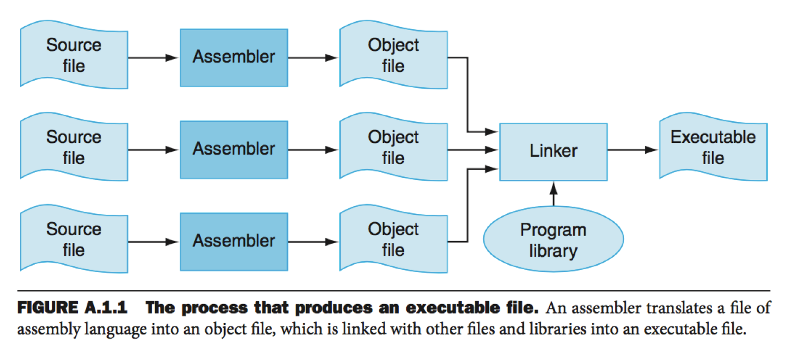

# GCC Compiler

## Table Of Contents

- [GCC Compiler] 

### GCC Compiler 

Creating an executable starts from a source *.cpp file to producing some executable *.exe binary file.

Compilation can involve up to four stages:  (always in the order below)

1. Pre-Processing
2. Compilation proper
3. Assembling
4. Linking

Stages 1 to 3,  apply to an individual source file, and end by producing an object file; 

Stage 4, linking, combines all the object files (those newly compiled, and those specified as input) into an executable file.



GCC choose to perform one or more of the steps above based on the compiler options provided. 

#### Step 1:  Pre-Processing

The first step, even before a .cpp file is compiled, is a pre-processing step, which expands header includes and substitues macros & inline functions to create a translation unit. 

To see just the pre-process step in GCC, use the -E compiler option: 

```cpp
gcc -E main.cpp -o main.i -I/path/to/headers
```

here, -I is additional option to give path of where all the include headers required by the file can be found.

```cpp
// difference between  <> and "" 
#include <foo.h>   // System header
#include “foo.h”  //  custom header, relative path
```

GCC srearches for  custom headers in the following paths:

```cpp
    /usr/local/include
    /usr/lib/gcc-lib/target/version/include
    /usr/target/include
    /usr/include
```

The system headers path folder is set with **-rPath** option. <br>
Additionally, **-isystem** can be used to treat the directory as path for system headers.

#### Step 2: Compilation Proper  (to x86/ARM assembley)

After step-1 above, the compiler, usually compiles the .cpp file into a target Assembley file, (ARM or x86). 

To just compile a single C++ file, **main.cpp** into a correspoding assembley file, use the -S option:

```bash
gcc -S -O0 main.cpp

# with additional options: 
gcc -S -O0 main.cpp -Wa,-adhln=main.s -g -fverbose-asm -masm=intel
```

**-o0:** is just optional to turn off optimizations.  <br>
**-Wa,-adhln=main.s** : instructs gcc to pass addtional parameters after it, directly to the Assembler. <br>
**-g** debug option interleaves the assembler listing with the original C code (optional, better to not to use if not debugging) <br>
**-fverbose-asm**: outputs additional information about which variable is manipulated in a register. <br>
**-masm=intel** changes the assembler mnemonics to Intel's style, instead of the AT&T style. <br>
<br>

#### Step 3: Assembling
Assembling is the process of translating the generated assembley instructions files to **target machine code** files, called object files.

Two main steps:<br>
– Find memory address for symbols (e.g. functions).<br>
– Translate each assembly statement by combining the numeric equivalents of opcodes, register specifiers, and labels into a legal instruction.

#### Step 4: Linking
During this step, the Linker pulls together identically named sections from different object files and merges them by concatenating different sections into one larger section.


The second thing that the linker does is that it reorders the sections so that sections with similar runtime needs are adjacent on disk.

In the final stage, Loader takes these adjacent chunks called segments, and maps them to memroy on page aligned boundaries. After this mapping the Laoder adjusts the page permissions accordingly, e.g. the .text segments require a R/X read-execute permission, and the data segments require read-write permissions.

#### Compile & Link Multiple Files into an Executable 

To compile a single .cpp file and convert it into an object .o file, use the -c option. The object files can then be linked into the final executable with a -o option.

```cpp
// only compile, .cpp files to .o
gcc -c main.cpp
gcc -c message.cpp

//  link all objects files into a binary
gcc -o main \
        main.o \
        message.o \
        -lstdc++
```
-lstdc++ command tells the linker to also statically link with libc++. 

#### Compile & Link Multiple into Libraries 

To compile the .cpp file to become part of a .so Shared Librray file, use the **-fPIC** flag, for position independent code, when compiling.

```bash
# use -fPIC  if code becomes part of a .so file
gcc -c myLibraryImpl.cpp -fPIC
```


```bash
gcc -o main main.o -lpthread -lrt -L.
```
Here we are telling GCC to link main.o with libpthread.so, librt.so and look for these librearies in the current directory (using -L option)

Once the executable is created, you can use the ldd command to see the dependent libraries it links against.

```bash
ldd main
```

## Object Files Format:

Object files are created in the **ELF** format (Executable and Link Format) in Unix & Linux and **Mach-O** format in MacOS. It is a format for storing programs or fragments of programs on disk. It simplifies the task of making shared libraries, and also enhances dynamic loading of modules at runtime.

It contains:
- Machine instructions in the .text section. This code may still require a **relocation-step** during linking (step 4).  
- **Symbols**: It contains meta-deta about the addresses of it's symbols.  Symbols are the names of functions and global variables. This data is present in an associative data structure called **Symbol Table**.

The inforamtion in object files is organized into "sections".

### Sections

Sections are blocks of code or data within the binary.

The ELF file defines a number of sections in an executable program. Important sections include the **Global Offset Table (GOT)**, which stores addresses of system functions, the **Procedure Linking Table (PLT)**, which stores indirect links to the GOT, .init/.fini, for internal initialization and shutdown, .ctors/.dtors, for constructors and destructors. The data sections are .rodata, for read only data, .data for initialized data, and .bss for uninitialized data. The summary of partial list of the ELF sections are organized as follows (from low to high):

1.  .init - Startup
2.  .text - **Source Code instructions**
3.  .fini - Shutdown
4.  .rodata - **Read Only data like consts** 
5.  .data - **Initialized Data**
6.  .tdata - Initialized Thread Data
7. .bss - **Uninitialized Data - (Zero Initialized)**
8.  .tbss - Uninitialized Thread Data
9.  .ctors - Constructors
10.  .dtors - Destructors
11. .got - **Global Offset Table**
12. .reloc **Relocation Section**
13. **IAT on windows**


# References:
1.  https://gcc.gnu.org/onlinedocs/gcc-3.1.1/gcc/Overall-Options.html#Overall%20Options

2.  What Happens After The Compiler in C++ (How Linking Works) - Anders Schau Knatten - C++ on Sea 2023
https://www.youtube.com/watch?v=h4s891KVN80 

3. CppCon 2018: Matt Godbolt “The Bits Between the Bits: How We Get to main()”
https://www.youtube.com/watch?v=dOfucXtyEsU 
 
4. Linkers, Loaders and Shared Libraries in Windows, Linux, and C++ - Ofek Shilon
https://www.youtube.com/watch?v=_enXuIxuNV4 
