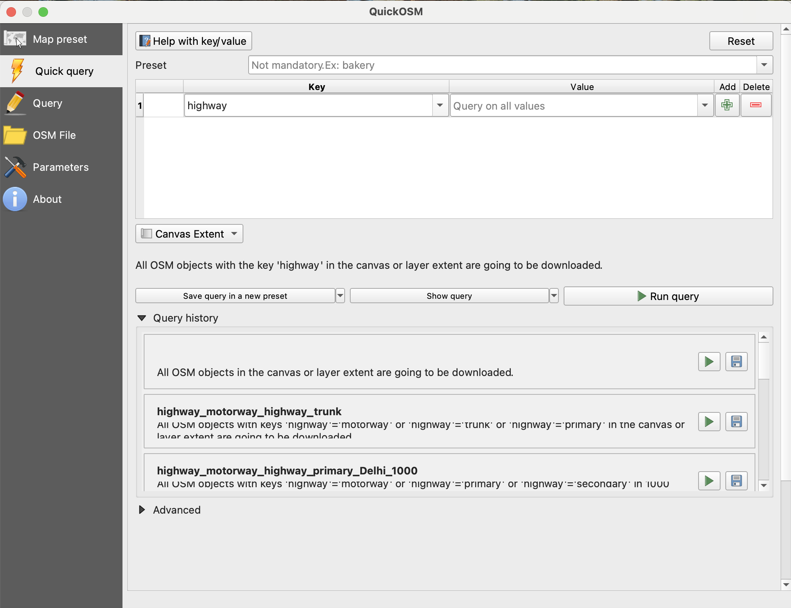

# OpenStreet Map

## QGIS

### Usefull  Plugins 
1. QuickOSM
2. Lat Lon Tools

### Pulling Data from OSM using QuickOSM

1.  Go to the [Map Featuress Page](https://wiki.openstreetmap.org/wiki/Map_features) .

2. E.g.: \
    for Roads choose key = 'Highway' \
    for buildings choose key = 'Buildings'

3. Choose from QuickOSM menu 

