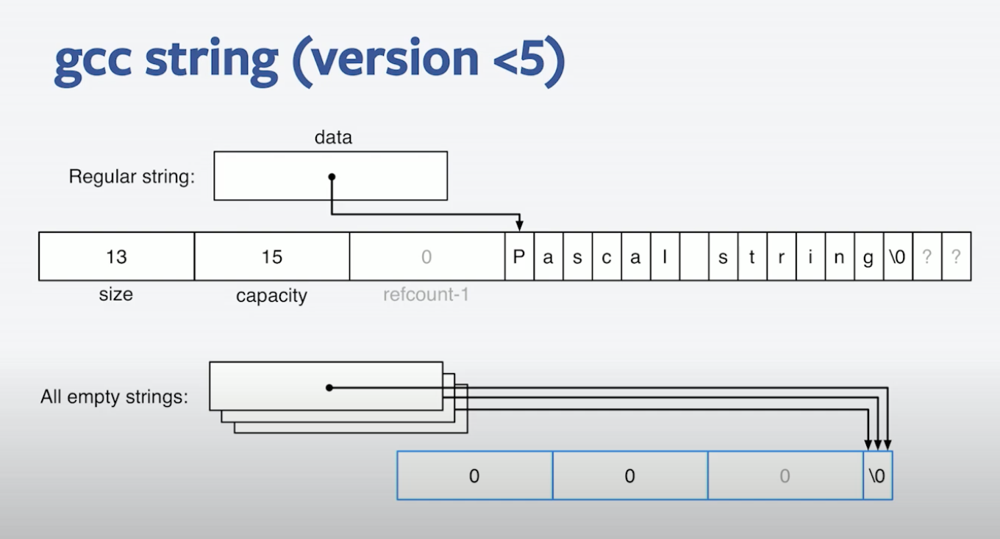

# Strings

## What is a String

A string is a sequence (or array) of **characters**.

Each character is represented as 1-byte. 
Each byte **encodes** one character of some **character-set**. 

A string has an inherent hidden problem of keeping track of it's **length**. This can be done with either by storing it's length in a sperate byte or terminating the string with zero/null character '\0'

## Null Terminated Strings

A null-terminated byte string is a sequence of bytes followed by a byte with value zero (the terminating null character). 

For example, the character array: 
{'\x63', '\x61', '\x74', '\0'} is an NTBS holding the string "cat" in ASCII encoding.

## C-Style String

This is just the null-terminated string.

## GCC's String Implementation

All empty strings point to a global empty string.

## Strings are Slow

1. Small String optimization in std::string.
    Smaller strings are not allocated on Heap but on stack to avoid numerous expensive mallocs.

2. 

## std::string
- Dont play nicely with string literals. It always involve a copy operation.

## C++17: std::string_view

The entire purpose of std::string_view is to avoid copying data which is already owned and of which only a fixed view is required. 

All that std::string_view needs to store is a pointer to the character sequence and a length.

The only catch with std::string_view is that it is non-owning, so the programmer is responsible for making sure the std::string_view does not outlive the string which it points to. 