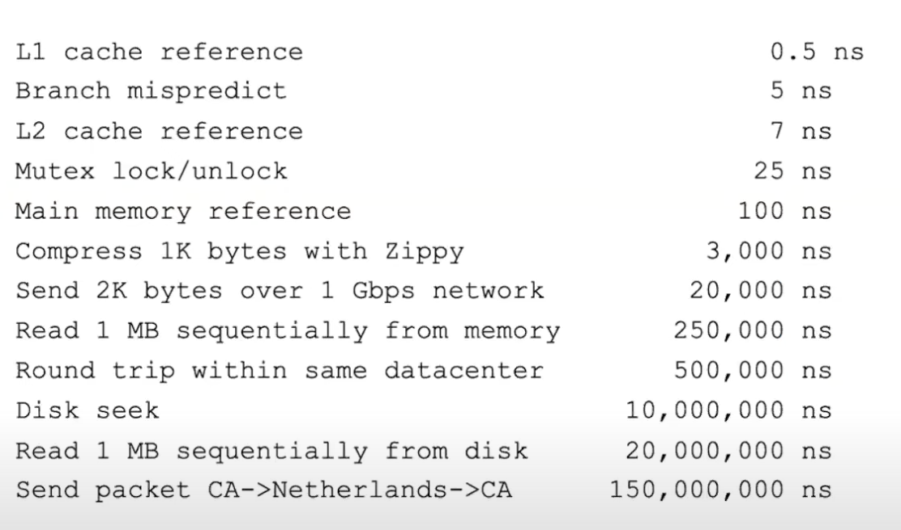

#  Processes & Threads

# Table of Contents
1. [Process](#process)
2. [Threads](#threads)
    * [Hardware Threads](#hardware-threads)
    * [Software Threads](#software-threads-or-system-threads)
3. [std::thread](#stdthread)
    * [Joinable State](#joinable-state)
    * [Unjoinable State](#unjoinable-state)
4. [Protecting Shared Data]
    * [Mutual Exclsuion]
    * [Lock Gaurds]
5. [Synchronization]
    * [Checking Flag and Sleeping]
    * [Condition Varibale]

5.  Non-Blocking Programming
    * [Lock Free Programming ]
    * [Wait Free Programming ]
6. [std::Atomics ]
7. std::Promise / std::Future
8. Examples
    * [Producer/Consumer ]
    

## **Process**
A Process is **an abstraction of a running program**.

A program becomes a process abstarction when the program's binary gets loaded into the memory and into the proper OS structure for process and put into the scheduler queue.

A process is just an instance of an executing program including the current values of:
-   instruction counter
-   registers
-   variables.



### *Process Creation*
Process creation happens every time the process creation **SystemCall** is executed.
Processes that stay in the background to handle some activity such as emails, printing, and so on are called **daemons**.

### *Inter Process Communication*
The separate processes can pass messages to each other through all the normal inter-process communication channels (signals, sockets, files,
pipes, and so on)

### *Distributed Program*
In distributed programming an application consists of  multiple processes cooperating together over different hosts machine. 


## **Threads**

#### *Def 1*
A thread is a *sequence of instructions*, given to the CPU by an application process.

#### *Def 2*
Threads are an abstraction of a virtual-cpu core from the P.O.V of an Operating System. 
A single execeution sequence that represents a seperately schedulable task.

#### *Def 3*
Threads are a unit of conccurrency provided by the OS.

A process is the protected environement that threads run into. A process includes an "Address-Space" plus a translation-map and a Page Table. And Threads runs inside that Address Space of a process. 

### **Parallelism vs Concurrency**

Parallelism is when multiple threads A,B,C run in pararllel on three different cores. 
<br>
Concurrency is when multiple threads A,B,C run on a single processor core, and this single core has to handle multiple things at once. It can do so e.g. by time-slicing/context switching between the three threads/tasks.
  

### **Synchronization vs Mutual-Exclusion**
Synchronization:    Coordination among threads, usually regarding the shared data (critical-section).
<br>
Mutual Exlusion:    Ensuring only one thread enters the critical-section at any time.


### **Hardware-Threads**

A single *CPU core*  can run one only one instruction of a thread at any given time.
The threads whose instructions are directly being run on the CPU core are called Hardware Threads.

-   The total no. of Hardware Threads determine how many threads can actually run in parallel on a system.

-   Hyper-Threading: (*introduced in Intel Pentium 4*) This is a hardware feature by which  each core can run multiple hardware threads, thus appearing to the OS as if more physical cores are present on the system.

### **Software-Threads (or System-Threads):**

These are the threads which the OS manages across the entire system for all processes/applications.

-   The OS schedules Software-Threads for execution on Hardware-Threads.
-   The Total no. of Software-Threads an OS can created is a limited resource.
-   It is usually possible to create more Software Threads than the no. of available Hardware Threads on a system. 

-   **OverSubscription**:
    When more Software-Threads are ready to run than the total no. of available 
    Hardware Threads. This is a problem because it leads to threads sitting idle.

-   **Thread-Scheduler**:
    This is an important component of the OS which deals with scheduling 
    Software-Threads on the hardware.
    When over-subscription occurs, the scheduler time-slices Software-Threads on
    the available Hardware-Threads. 
    A **context-switch** is performed between software-threads, which can lead to
    overhead in thread-management. As it can lead to cache invalidation for other
    threads.

    -   **Thread-Pools**:
        Modern schedulers use system-wide thread pools, which deals with
        problems like oversubscription, load-balancing etc. through
        work-stealing algorithms.

### **std::thread**

Objects of this class acts as handles to the underlying Software-Threads.

- An std::thread object always correspond to a unique System-Thread. 
- No two objects can point to the same System-Thread. 
- std::thread objects are moveable but not copyable.
- As soon an std::thread object is created, a thread is scheduled to be launched asynchronously from the current thread.

```(c++)

void doWork(){
    // ...
}


int main(){
    
    // step 1:  create a Thread
    // a thread is launched/scheduled immediately on creation
    std::thread worker_thread(doWork);

    // ....
    
    //  don't forget to: 
    // Step 2:  
    // Handle exceptions if the System is out of threads

    // Step 3:  
    // call join() on all threads created by the program before program terminates

    //  description follows for above steps.
}
```

An std::thread object can be in any one of the two states:

-   Joinable
-   Unjoinable

#### Joinable State:

A joinable std::thread object means that it is:
-   currently running
-   waiting to be scheduled (it is just created)
-   blocked (or waiting on mutex)
-   has finished executing it's function.

**Note:** If a destructor of a joinable thread is triggered, the program terminates.

So always call `std::thread::join()` before the program exits.

#### UnJoinable State:

## Synchronization Primitives

-   std::mutex
-   std::lock_guard
-   std::scoped_lock

### MUTEXES

The most basic mechanism for protecting shared data provided by the C++ Standard is the mutex.


## Parallel STL Algorithms:

### Execution Policy

- std::execution::seq
- std::execution::par
- std::execution::par_unseq

Parallel execution policies starts all the threads at the beginning of each parallel algorithm and joins them at the end. Launching new threads takes significant time, so when the computation is short, the overhead overwhelms any speedup we can get from parallelism. This is not a requirement imposed by the standard, but the way the current implementation of parallel STL in GCC and Clang manages its interactions with the TBB system. 

#### Deadlocks & Vectorization-Unsafe code

## Coroutines (C++20)

## Compiler Support for Parallel 

- Recent versions of GCC and Clang include parallel STL headers.
- Clang requires GCC to be installed because it uses GCC provided parallel STL.
- The runtime threading system used by both compilers is Intel's Thread Building Blocks (TBB), 
  which is a library with it's own set of headers. Neither compiler includes TBB in its installation.
- To complicate matters even more, each version of the compiler requires the corresponding version of TBB: neither an older nor a more recent version will work (the failures can manifest themselves at both compile and link-time). To run the programs linked with TBB, you will likely need to add the TBB libraries to your library path.


## Atomics

- Defintion: 
An atomic operation is something which is guaranteed to execute as a single operation. Other threads can either see the state of the System before the operation or after it has finished, but cannot see any intermediate state.

- On the very low-level, atomic operations are special hardware instruction, where hardware guarantees atomicity.

### std::atomic

- increment <p>
Increment is the most basic operation. But it consists of three operations in one: 
 - - Read 
- -  Modify 
- -  Write


-----------------------
Callbacks
-----------------------
A callback function is a function passed into another function as an argument. The callback is then invoked later to signal completion of some kind of routine or action.

 # std::Promise / std::Future

The promise/future mechanism provides a way for two different threads to communicate result of an operation with each other.

 ##  std::Future \<T>
The class template `std::future` provides a way to access the result of an asynchronous-operation.  Usually one thread creates another thread and launches it asynchronously. The creator of the asynchronous-operation can then use a returned  `std::future` object to query, wait for, or extract a value from it. 

When the asynchronous operation is ready to send a result to the creator, it can do so by modifying `shared state` linked to the std::future.

 ##  std::Promise \<T>
